# Arch/Artix Linux installation guide with full disk encryption

## Pre-installation

### Download distribution image

First of all, let's download distribution image.

- #### Arch GNU/Linux

The .iso image can be downloaded on the [download page](https://archlinux.org/download/).

- #### Artix GNU/Linux

Artix GNU/Linux has more variations than Arch GNU/Linux. Artix GNU/Linux download page provides .iso images with various initialization systems (OpenRC, Dinit, Runit, S6, Suite66) and desktop environments (Cinnamon, LXDE, LXQT, MATE, KDE Plasma, XFCE).
In this guide, we will install Artix GNU/Linux with OpenRC and without desktop environment (base install).
The .iso image can be downloaded on the [download page](https://artixlinux.org/download.php).

### Verify integrity

To do this, we need to compare the hash sum of the distribution image with the hash sum provided on the download page.

- #### Arch GNU/Linux

The .iso image checksums are listed on the [download page](https://archlinux.org/download/).

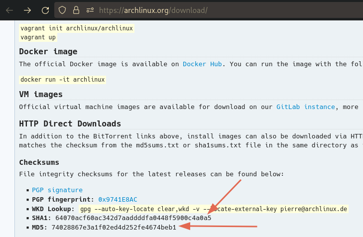

Checksums are also listed on the mirror sites listed on the [download page](https://archlinux.org/download/).

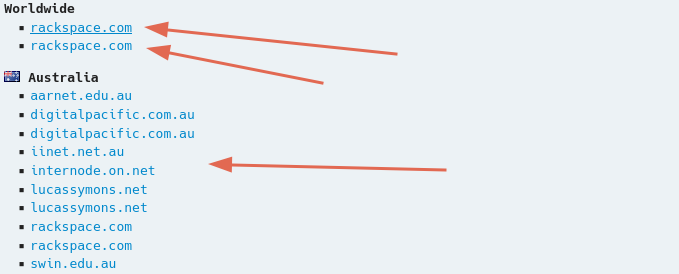

For example, on this [mirror site](https://mirror.rackspace.com/archlinux/iso/2022.03.01/) , the checksums are in .txt files.

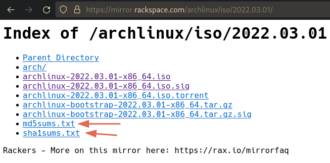

The content of the .txt file containing SHA-1 checksums:

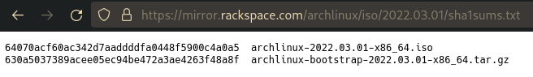

To get the SHA-1 hash sum of the .iso image, we need to do the following:
```zsh
sha1sum path/to/arch/image
```

Example of the command result:

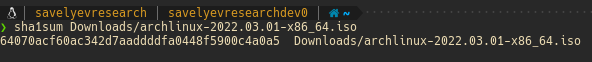

We see that the SHA-1 hash sums are equal.

- #### Artix GNU/Linux

The .iso image checksums are listed on the [download page](https://artixlinux.org/download.php).

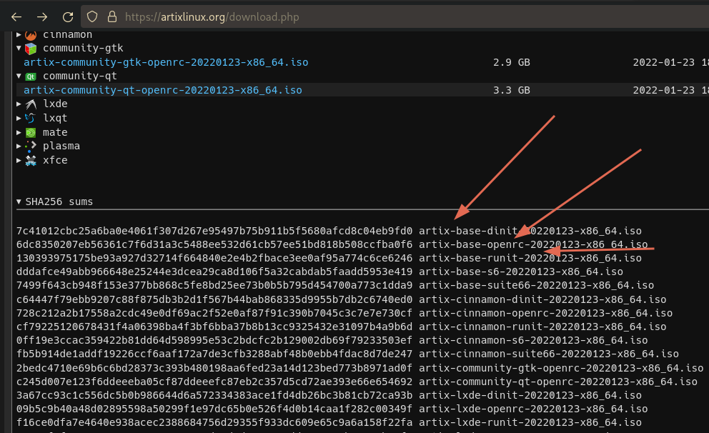

Checksums are also listed on the mirror sites listed on the [download page](https://artixlinux.org/download.php).

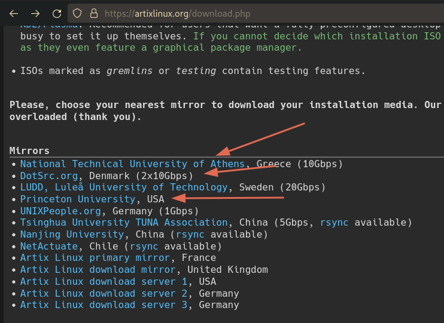

For example, on this [mirror site](https://mirrors.dotsrc.org/artix-linux/iso/) , the checksums are in sha256sums file.

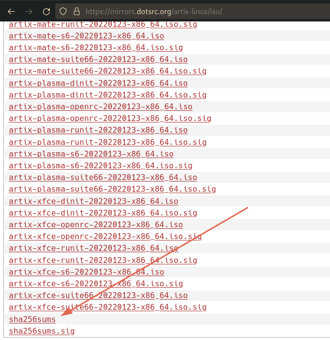

The content of the sha256sums file containing SHA-256 checksums:

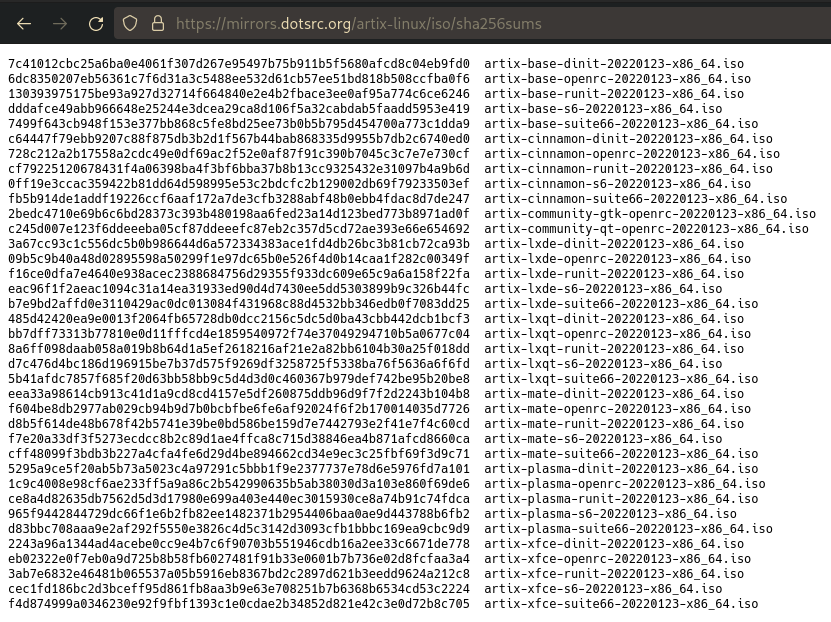

To get the SHA-256 hash sum of the .iso image, we need to do the following:
```zsh
sha256sum path/to/artix/image
```
Example of the command result:

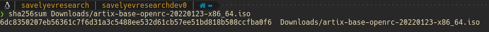

We see that SHA-256 hash sums are equal.

### Verify signature

Let's download the GPG signature file corresponding to the distribution image we downloaded. And verify the .iso image.

- #### Arch GNU/Linux

To verify the Arch GNU/Linux image using GNU Privacy Guard, we need to do the following:
```zsh
gpg --keyserver-options auto-key-retrieve --verify archlinux-version-x86_64.iso.sig
```
After executing this command, you should see the following:

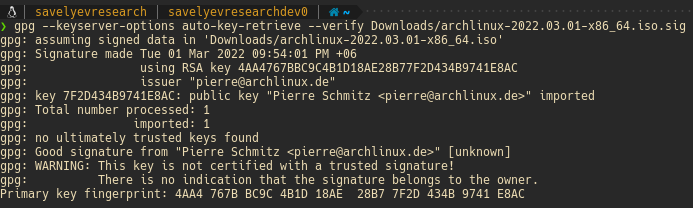

This is a "Good signature", so everything is fine.

- #### Artix GNU/Linux

For Artix GNU/Linux, the command is similar:
```zsh
gpg --keyserver-options auto-key-retrieve --verify artix-base-openrc-version-x86_64.iso.sig
```

After executing this command, you should see the following:

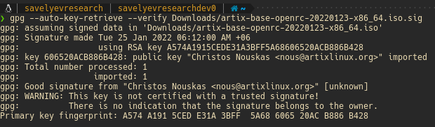

This is a "Good signature", so everything is fine.

### Creating a USB drive with a recorded distribution image

This will irrevocably destroy all data on you USB drive.
To find the name of your USB drive, you need to use `lsblk` command. Make sure that it is not mounted.

- #### On GNU/Linux

Using `dd` command:
```zsh
dd bs=4M if=path/to/distribution/image of=path/to/usb/drive
```

Using `cat` command:
```
cat path/to/distribution/image > path/to/usb/drive
```

Using `cp` command:
```zsh
cp path/to/distribution/image path/to/usb/drive
```

Using `tee` command:
```zsh
tee < path/to/distribution/image > path/to/usb/drive
```

Using `pv` command:
```zsh
pv path/to/distribution/image > path/to/usb/drive
```

All these commands are part of GNU core utilities.

- #### On Windows

You need to download some software to create bootable USB drives. For example: Rufus, Etcher.

### Boot the live environment

Arch GNU/Linux and Artix GNU/Linux installation images do not support Secure boot.
You will need to disable Secure boot to boot the installation medium.
If desired, Secure boot can be set up after completing the installation.

For this step, you need to restart your computer and enter the boot menu, then select your USB drive as the boot device (just change the boot priority).
Save the download settings and start your computer.

Congratulations, you have launched Arch/Artix Linux!

### Set the keyboard layout

To check the available layout types:
```zsh
ls -R /usr/share/kbd/keymaps/
```

To set the keyboard layout, pass a corresponding file name to loadkeys command, omitting path and file extension. 

For example, to set the Spanish (Spain) layout, type:
```zsh
loadkeys es
```

Console fonts are located in `/usr/share/kbd/consolefonts/` and can likewise be set with setfont command.

### Verify the boot mode

To verify the boot mode, list the efivars directory:
```zsh
ls /sys/firmware/efi/efivars
```

If the command shows the directory without error, then the system is booted in UEFI mode.
If the directory does not exist, the system may be booted in BIOS (or CSM) mode.
If the system did not boot in the mode you desired, refer to your motherboard's manual.

### Connect to the internet

- #### Arch GNU/Linux

Ensure your network interface is listed and enabled, for example with ip-link command:
```zsh
ip link
```

For wireless and WWAN, make sure the card is not blocked with rfkill.

How to list all wireless cards using rfkill?

```zsh
rfkill list
```

Example of the command result:

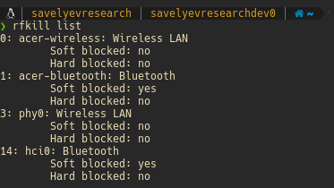

If your wireless card is blocked by rfkill, execute the following:
```zsh
rfkill unblock wifi
```
or
```zsh
rfkill unblock all
```

It is possible that the card will go from hard-blocked and soft-unblocked state into hard-unblocked and soft-blocked state by pressing the hardware button (i.e. the soft-blocked bit is just switched no matter what).
This can be adjusted by tuning some options of the rfkill Kernel module.

Now we use `iwctl` to connect to a wireless network.

To get an interactive prompt for `iwctl` do:
```zsh
iwctl
```

In the iwctl prompt you can auto-complete commands and device names by hitting `Tab`.
To exit the interactive prompt, send EOF by pressing `Ctrl+d`.
You can use all commands as command line arguments without entering an interactive prompt. For example: `iwctl device wlan0 show`.

To list all available commands:
```zsh
[iwd]# help
```

##### Connect to a network

First, if you do not know your wireless device name, list all Wi-Fi devices:
```zsh
[iwd]# device list
```

Then, to scan for networks: 
```zsh
[iwd]# station device scan
```

You can then list all available networks: 
```
[iwd]# station device get-networks
```

Finally, to connect to a network:
```zsh
[iwd]# station device connect SSID
```

If a passphrase is required, you will be prompted to enter it. Alternatively, you can supply it as a command line argument:
```zsh
iwctl --passphrase passphrase station device connect SSID
```

To check your internet connection, execute the following:
```
ping archlinux.org 
```
Example of the command result:

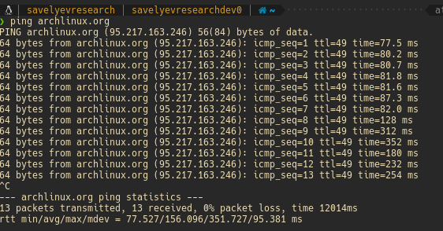

- #### Artix GNU/Linux

Everything is similar with Arch GNU/Linux, only for wireless connections you need to use connmanctl.

To get an interactive prompt for connmanctl do:
```zsh
connmanctl
```

In the connmanctl prompt you can auto-complete commands and device names by hitting `Tab`.
To exit the interactive prompt, send EOF by pressing `Ctrl+d`.
You can use all commands as command line arguments without entering an interactive prompt. For example: `connmanctl enable wifi`.

To list all available commands:
```zsh
connmanctl help
```

##### Connect to a network

To scan for nearby Wi-Fi networks:
```zsh
connmanctl scan wifi
```

To list the available networks found after a scan run:
```
connmanctl services
```

To connect to an open network, use the second field beginning with wifi_:
```zsh
connmanctl connect wifi_some-network-id
```

To check your internet connection, execute the following:
```
ping artixlinux.org 
```

Example of the command result:

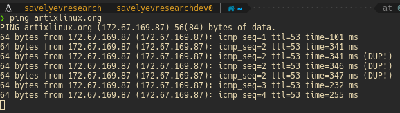

### Enable Network Time Protocols

Enable Network Time Protocols (NTP) and allow the system to update the time via the Internet.

- #### Arch GNU/Linux

```zsh
timedatectl set-ntp true
```

To check the NTP service status, use:

```zsh
timedatectl status
```

- #### Artix GNU/Linux

For this, we need to download `ntp` package using `pacman` package manager:
```
sudo pacman -Sy ntp
```

Configuration file for NTP is located at the path `/etc/ntp.conf`.

Example:

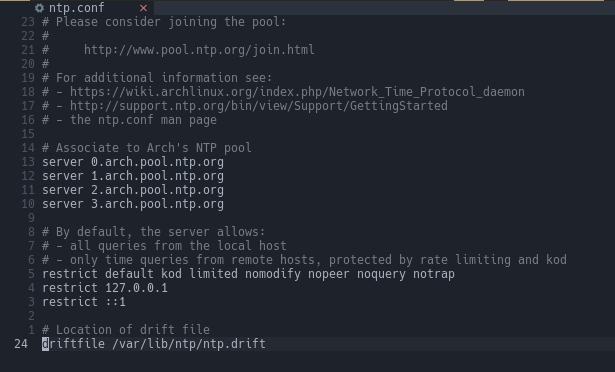

In order to update the time use the following command from the command prompt:
```zsh
ntpdate pool.ntp.org
```

If the commands of the `ntp` package do not exist in the current terminal session, just open a new terminal.

You can now start (or restart) the NTP service to synchronize the clock.
```zsh
sudo rc-service /usr/bin/ntpd start
```

Also you can add `ntpd` to the `default runlevel`.
```zsh
sudo rc-update add /usr/bin/ntpd
```

You can verify that your machine is synchronizing the time by using the `ntpq` command.
It could take a little while to synchronize the first time around, so be patient.
From the command line execute the `ntpq` command with the `-p` option, as below:
```zsh
ntpq -p
```

This will print out a list of servers:

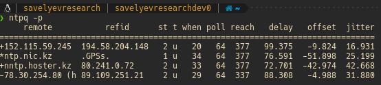

Now, in the list of servers verify that one of the remote servers start with an asterisk (*).
That is the server that is currently being used to synchronize your clock.

### Prepare for LUKS encryption

Before disk setup, load the `dm-crypt` and `dm-mod` kernel modules:
```zsh
modprobe dm-crypt
```
```zsh
modprobe dm-mod
```

### Partition the disks

When recognized by the live system, disks are assigned to a block device such as `/dev/sda`, `/dev/nvme0n1` or `/dev/mmcblk0`.
To identify these devices, we will to use lsblk command.
```zsh
lsblk
```

Example:

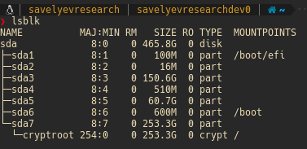

The following partitions are required for a chosen device:
- One partition for the root directory `/`;
- For booting in UEFI mode: and EFI system partition.

**Tip**: If the disk does not show up, make sure the disk controller is not in RAID mode.
**Tip**: If the disk from which you want to boot already has an EFI system partition, do not create another one, but use the existing partition instead.
**Tip**: Swap space can be set on a swap file for file systems supporting it.

- #### BIOS mode

Run `cfdisk` to create two partitions, one for boot and another for the encrypted root.
Swap space will be used as a swap file in the encrypted root file system.

Run `cfdisk` and if asked choose `dos`:
```zsh
cfdisk /dev/sda
```

Then, you will see the following:

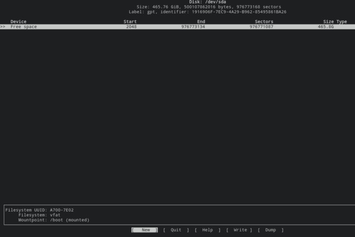

Now let’s create our partitions, a first on with `600MB` and another one to get the remaining space:
- Go to `New` and press `Enter`, in partition size write `600MB` and press `Enter`;
- Choose `Free space` and go to `New` and press `Enter`, leave space and press `Enter`;
- Go to `Write` and confirm when asked. Go to `Quit` and leave.

You should now have two partitions:
- `/dev/sdaX` - ext4 boot (`/dev/sdaX` in this case is the boot partition)
- `/dev/sdaX` - ext4 root (`/dev/sdaX` in this case is the root partition)

- #### UEFI mode

Run `cfdisk` to create three partitions, one for EFI (if the EFI system partition already exists, just use this partition), another for boot and a third for the encrypted root.
Swap space will be used as a swap file in the encrypted root file system.

Run `cfdisk` and if asked choose `gpt`:
```zsh
cfdisk /dev/sda
```

Now let’s create our partitions, a first one with `600MB`, a second one with `600MB` (If you need) and a third to get the remaining space:
- Go to `New` and press `Enter`, in partition size write `600MB` and press `Enter`;
- Go to `Type` and choose `EFI System`:

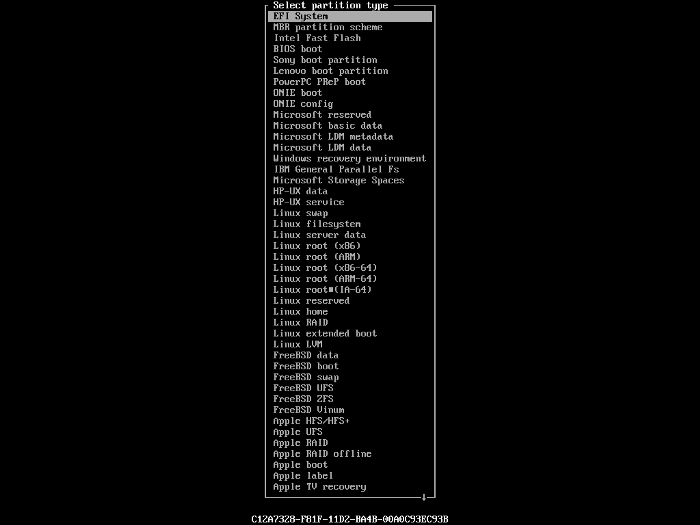

- Choose `Free space`, go to `New` and press `Enter`, in partition size write `600MB` and press `Enter`;
- Choose `Free space` and go to `New` and press `Enter`, leave space and press `Enter`;
- Go to `Write` and confirm when asked. Go to `Quit` and leave.

You should now have three partitions:
- `/dev/sdaX` - EFI system partition (`/dev/sdaX` in this case is the EFI system partition)
- `/dev/sdaX` — ext4 boot (`/dev/sdaX` in this case is the boot partition)
- `/dev/sdaX` - ext4 root (`/dev/sdaX` in this case is the root partition)

### Encrypt root partition

Let’s encrypt root partition. Use the following command, confirm with uppercase `YES` and type your desired password:
```zsh
cryptsetup luksFormat /dev/sdaX # /dev/sdaX in this case is the root partition
```

If you want to move to a tougher path, use the following command:
```zsh
cryptsetup --type luks2 --cipher aes-xts-plain64 --hash sha512 --iter-time 5000 --key-size 512 --pbkdf argon2id --use-urandom --verify-passphrase luksFormat /dev/sdaX # /dev/sdaX in this case is the root partition
```

You can also create a key file for this encrypted partition.

A key file is a file whose data is used as the passphrase to unlock an encrypted volume.

There are many options for creating a key file. In this guide, we are creating a key file with a large number of random characters.
I think this is the safest option because a large number of random characters guarantee high variance.

To create a key file, we will use the `dd` command:
```zsh
dd bs=1M count=2 if=/dev/random of=/etc/mykeyfile iflag=fullblock
```

If you are planning to store the key file on an external device, you can also simply change the output file to the corresponding directory:
```zsh
dd bs=1M count=2 if=/dev/random of=/media/usbstick/mykeyfile iflag=fullblock
```

To deny any access for other users than root:
```zsh
chmod 600 /etc/mykeyfile
```

Add a key slot for the key file to the LUKS header:
```zsh
cryptsetup luksAddKey /dev/sdaX /etc/mykeyfile # /dev/sdaX in this case is the root partition
```

To make sure that the encrypted partition has two key slots (passphrase and key file), do the following:
```zsh
cryptsetup luksDump /dev/sdaX # /dev/sdaX in this case is the root partition
```

I recommend saving this output to a file and then moving it to an external USB drive:
```zsh
cryptsetup luksDump /dev/sdaX > cryptroot.dump # /dev/sdaX in this case is the root partition
```
```zsh
mv /path/to/cryptroot.dump /path/to/mounted/usb/drive
```

Now open the encrypted partition to allow access to it. The command will prompt for the password, and the partition will be available though `/dev/mapper/cryptroot`:
```zsh
cryptsetup open /dev/sdaX cryptroot # /dev/sdaX in this case is the root partition
```

Or you can specify a key file to open this encrypted partition:
```zsh
cryptsetup open --key-file /path/to/keyfile /dev/sdaX cryptroot # /dev/sdaX in this case is the root partition
```

If the header of a LUKS encrypted partition gets destroyed, you will not be able to decrypt your data.
It is just as much of a dilemma as forgetting the passphrase or damaging a key-file used to unlock the partition. Damage may occur by your own fault while re-partitioning the disk later or by third-party programs misinterpreting the partition table.
Therefore, having a backup of the header and storing it on another disk might be a good idea.

To back up the header of an encrypted LUKS partition, do the following:
```zsh
cryptsetup luksHeaderBackup /dev/sdaX --header-backup-file /path/to/backup/file/cryptroot.img # /dev/sdaX in this case is the root partition
```

Then move it to an external USB drive:
```zsh
mv /path/to/backup/file/cryptroot.img /path/to/mounted/usb/drive
```

[More detailed information about cryptsetup](https://wiki.archlinux.org/title/Dm-crypt/Device_encryption).

### Format and mount file system

- #### BIOS mode

Format and mount file system:
```zsh
mkfs.ext4 -L boot /dev/sdaX # /dev/sdaX in this case is the boot partition
```
```zsh
mkfs.ext4 -L root /dev/mapper/cryptroot
```

Now mount them:
```zsh
mount /dev/mapper/cryptroot /mnt
```
```zsh
mkdir /mnt/boot
```
```zsh
mount /dev/sdaX /mnt/boot # /dev/sdaX in this case is the boot partition
```

Finally, create swap file:
```zsh
dd if=/dev/zero of=/mnt/swapfile bs=1G count=(RAM * 2)
```
```zsh
chmod 0600 /mnt/swapfile
```
```zsh
mkswap /mnt/swapfile
```
```zsh
swapon /mnt/swapfile
```

To make sure that the swap file has been initialized, do the following:
```zsh
free -h
```
